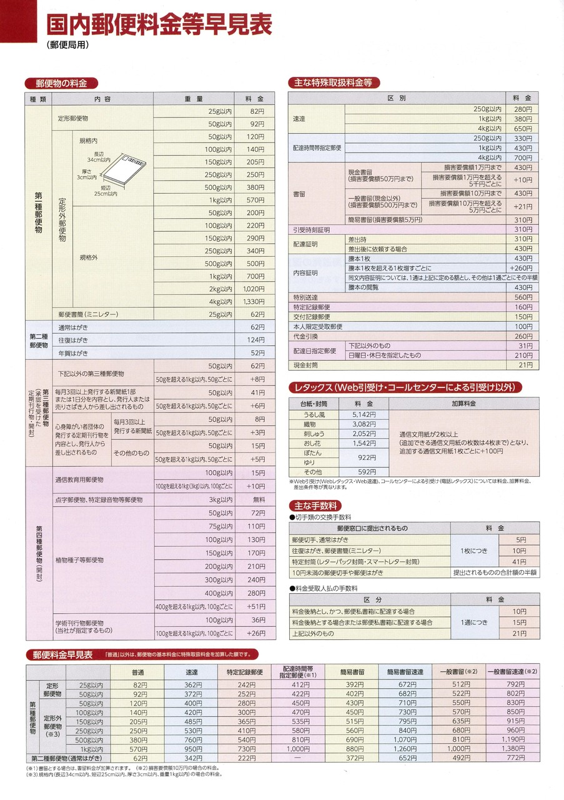

# 事務関連のマニュアル
## 休日の出勤について
前日の昼までに上長と相談の上、社長へ個別に申請をします。

**休日出勤時のタイムカードの打刻漏れには特に注意してください。**最悪、認められないケースも発生するので、慎重に対応をお願いします。

## 経費の計算について
主な適用項目は次の通りです。
- 資料代
- 通信費
- 消耗品費

|概要  |内容
|--|--
|資料代   |資料本 有料アプリ
|通信費   |切手 宅配便料金
|消耗品費 |文具 台所用品

## 宅配の発送について
## 電話・来客対応について
## ごみ収集について
## プリンターについて
## 大容量データの送受信について